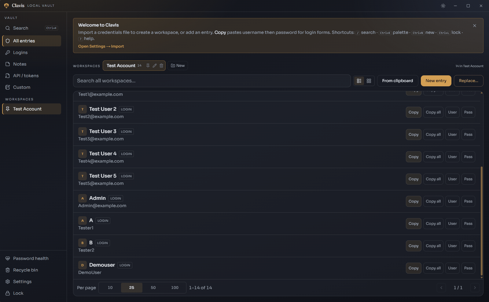
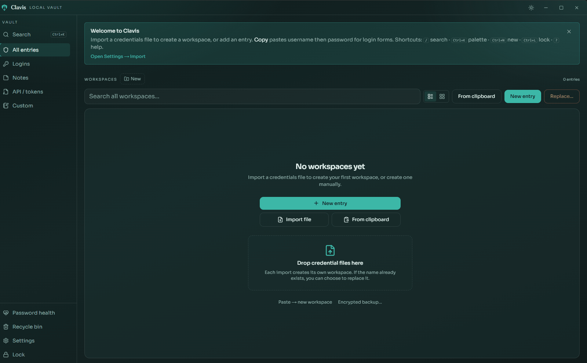
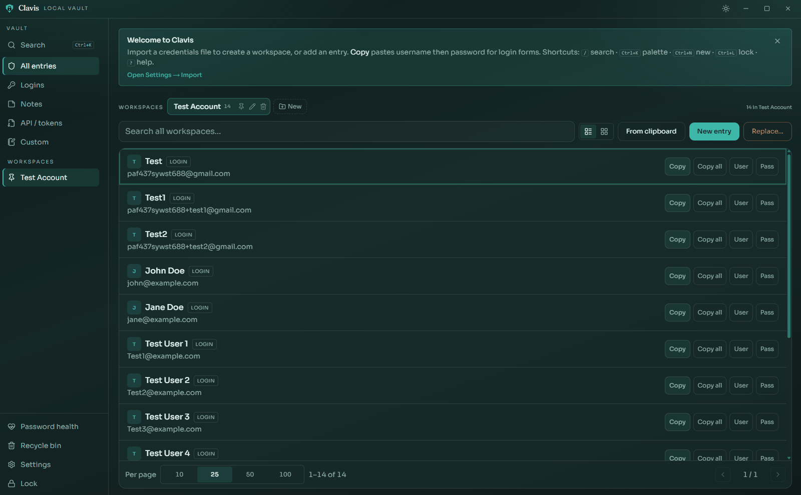
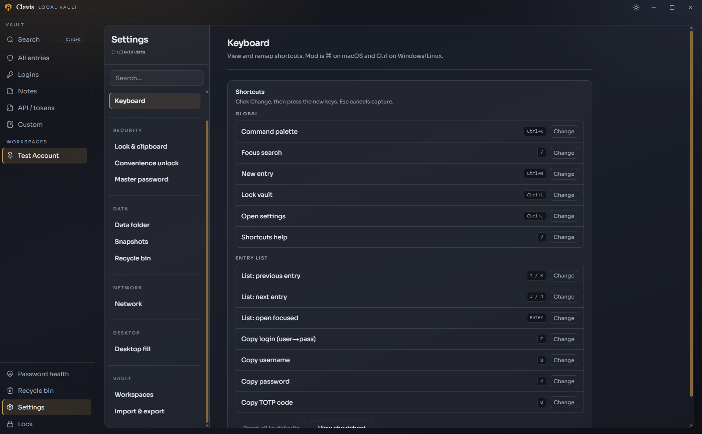
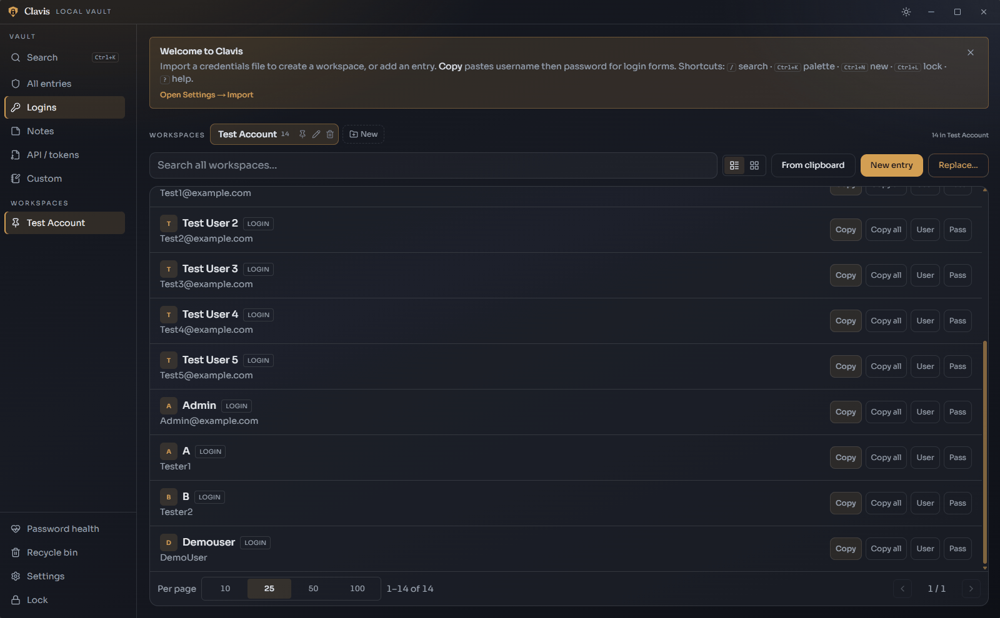

# Clavis (Keys Manager)

**Local-first, portable credential vault** — Tauri v2 + Rust core + Next.js UI.  
**OSS · self-signed / unsigned releases** (see below). Current version: **0.18.1**.

Clavis keeps passwords, API tokens, and secure notes in an encrypted file you control. No cloud account, no vendor sync service — copy the install folder to USB, point a synced folder at Syncthing, or run entirely offline. Unlock with a master password; find and copy credentials in a few keystrokes.

**Detailed guide:** [docs/features.md](docs/features.md) · **Threat model:** [docs/threat-model.md](docs/threat-model.md) · **Roadmap:** [docs/roadmap.md](docs/roadmap.md)

---

## Demos

### Search and command palette

Global search from the sidebar or `Ctrl/Cmd+K`. Jump to any entry, workspace, vault view, or settings section; copy credentials by typing after you filter.



### Import credentials

Drop a CSV or export file onto the vault. Clavis creates a workspace (named from the file) and imports entries in one step.



### Appearance and layout

Light, dark, or system theme; **Seafoam** and **Graphite** skins; default list or grid layout and page size — all in Settings → Appearance.



### Keyboard-first workflow

List focus with arrow keys or `j`/`k`; copy login, user, pass, or TOTP without the mouse. Press `?` for the cheatsheet; remap any shortcut under Settings → Keyboard.



### Recycle bin

Deleting an entry moves it to the recycle bin (soft delete). Restore mistakes or purge permanently; retention days are configurable in Settings.



---

## Features at a glance

| Area | Highlights |
|------|------------|
| **Vault** | Argon2id + AES-256-GCM `vault.km`; login, note, API, and custom entry types |
| **Workspaces** | Per-import containers; rename, delete, merge; no empty default on new vaults |
| **Search** | Toolbar search across all workspaces; command palette for navigation and actions |
| **Copy / fill** | Sequential clipboard copy with auto-clear; optional Windows autotype (confirm first) |
| **Security** | Auto-lock, lock-on-hide, optional keyring unlock, local password health, offline-by-default |
| **Portability** | Data next to the binary; optional custom/synced data folder |
| **Backups** | Encrypted export, snapshots, recycle bin with retain policy |

Full feature and design write-up: **[docs/features.md](docs/features.md)**.

---

## Prerequisites

- [pnpm](https://pnpm.io) 9+
- Rust (stable) + [Tauri prerequisites](https://v2.tauri.app/start/prerequisites/)

## Setup

```bash
pnpm install
```

## Commands (from repo root)

| Command | What it does |
|---------|----------------|
| `pnpm dev` | Desktop app (Tauri + web UI) |
| `pnpm dev:web` | Web UI only (browser, no vault IPC) |
| `pnpm dev:desktop` | Same as `pnpm dev` |
| `pnpm --filter @clavis/mobile android:init` | Once: generate Android Studio project |
| `pnpm --filter @clavis/mobile android:dev` | Mobile preview on emulator/device |
| `pnpm build` | Release desktop build |
| `pnpm build:web` | Static export of the web UI |
| `pnpm test:vault` | Rust `vault-core` tests |
| `node scripts/checksum-release.mjs <path>` | SHA-256 lines for release artifacts |

Light/dark theme toggle lives in the custom titlebar and Settings. Theme preference is stored in `data/config.json`.

Credential imports create a **workspace** (named from the file). If that name already exists, Clavis asks whether to **replace** it. Workspaces live in the **dashboard** strip (not the sidebar). Toggle **list / grid** for entries; name and categorize items in the editor.

**Search & shortcuts** (Windows / Linux / macOS): toolbar search matches all workspaces when you type a query; `Ctrl/Cmd+K` opens the command palette (rebindable); `/` focuses toolbar search; `Ctrl/Cmd+N` new entry; `Ctrl/Cmd+L` lock; `Ctrl/Cmd+,` settings; `?` shortcuts help; ↑/↓ or `j`/`k` move list focus; `c`/`u`/`p`/`o` copy login/user/pass/TOTP; `Esc` closes palette/editor. Remap in Settings → Keyboard.

## Installing self-signed builds

GitHub Releases may include installers that are **not** signed by Microsoft/Apple store certificates.

| OS | What you may see | What to do |
|----|------------------|------------|
| Windows | SmartScreen “Windows protected your PC” | More info → **Run anyway** (after verifying the SHA-256 on the release) |
| macOS | “App can’t be opened because it is from an unidentified developer” | System Settings → Privacy & Security → **Open Anyway** |
| Linux | Depends on package | Prefer checksum match + build from the release tag |
| Android | “Unknown apps” / Play Protect | Sideload APK after checksum + `TRUST.md` cert match — **not** Play Store signed |
| iOS | Developer / free provisioning | IPA from Releases is **not** App Store; free Apple ID builds expire ~7 days |

**Always verify checksums** against `SHA256SUMS` / `SHA256SUMS-*.txt` (or hashes listed on the release) before running a downloaded binary. Compare publisher fingerprints with [`TRUST.md`](TRUST.md) when present. Prefer building from source if you do not trust a binary:

```bash
git checkout v0.18.1   # or the release tag
pnpm install
pnpm build
```

Maintainer release steps: [docs/release-checklist.md](docs/release-checklist.md). Mobile Signet CI secrets: [docs/signet-ship.md](docs/signet-ship.md).

## Layout

```
apps/web          @clavis/web     Next.js static UI
apps/desktop      @clavis/desktop Desktop Tauri shell
apps/mobile       @clavis/mobile  Mobile preview shell (Android/iOS)
crates/vault-core                 Encrypted vault library
crates/clavis-shell               Shared Tauri IPC
docs/                             Features, threat model, roadmap, demos
scripts/                          Release checksum helper
```

## Data location

Desktop: `{executable_directory}/data/` (**portable default**). Encrypted vault file: `vault.km`. For USB plug-and-play, copy the **entire install folder** (app + `data/`). Prefer portable default over a custom absolute path; Settings → **Make portable** relocates the vault next to the binary. Mobile preview: OS app sandbox.

Offline-first: outbound network is off by default (`allowNetwork`); optional favicon fetch requires an explicit opt-in.

**Multi-device:** point Settings → Data folder at a Syncthing/cloud/USB directory you sync yourself (keep `vault.km` + `attachments/` together). Concurrent edits are last-write-wins; Clavis locks if the file changes under an open session. There is no Clavis cloud.

See [docs/START-HERE.md](docs/START-HERE.md) for the dev loop. Platforms & keyring: [docs/platforms.md](docs/platforms.md). Architecture: [docs/architecture.md](docs/architecture.md).
